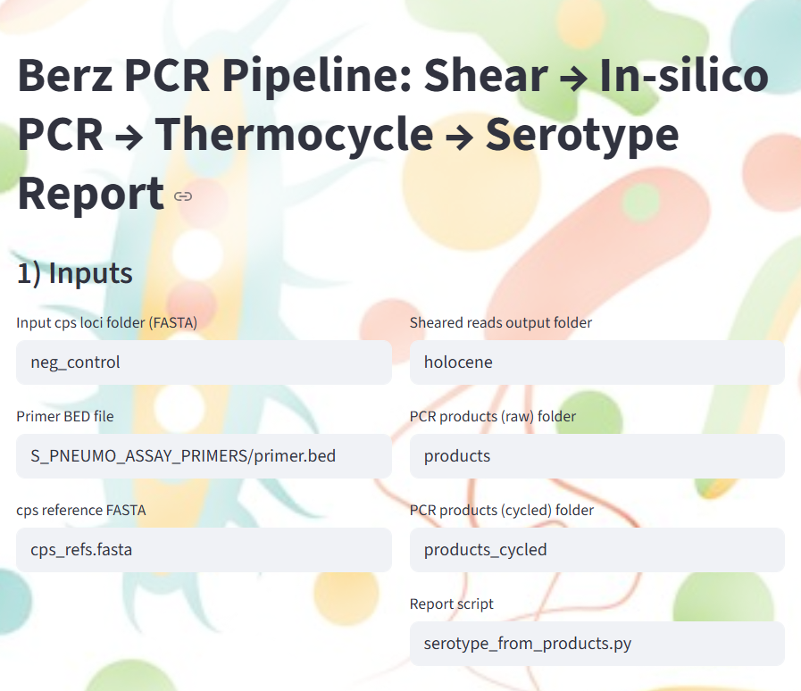
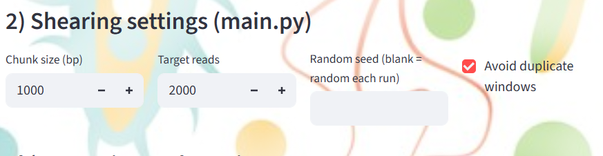
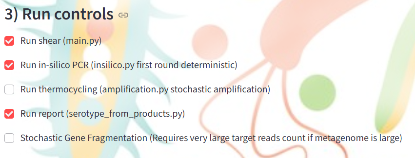
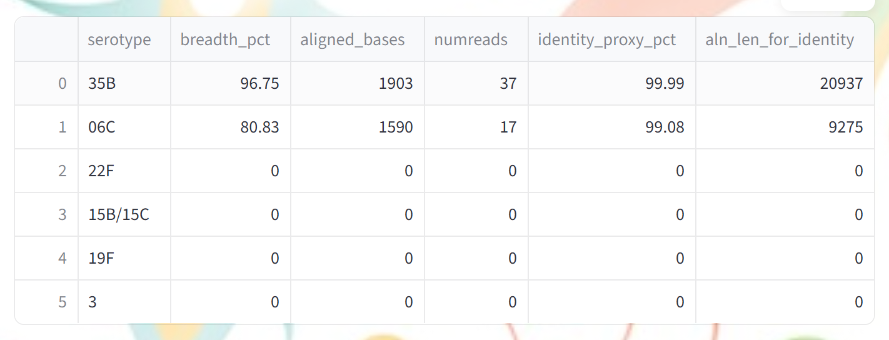
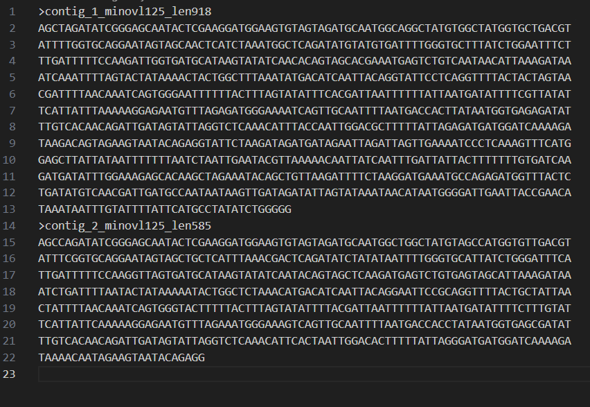
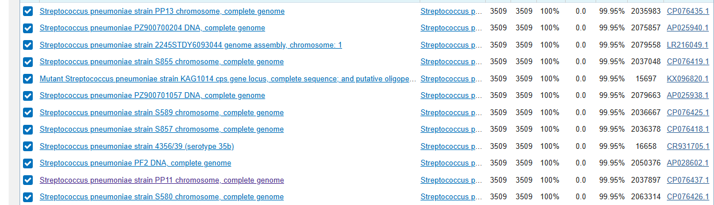

# 🧬 Berz PCR Pipeline

### Shear → In-silico PCR → Thermocycle → Assembly → Serotype Ranking

A modular simulation and analysis framework for **tiled PCR assays** on _Streptococcus pneumoniae_ cps loci.

This pipeline models:

1. Genome fragmentation (metagenomic shearing)
    
2. Deterministic in-silico PCR with mismatch constraints
    
3. Stochastic thermocycling and Ct simulation (experimental/optional)
    
4. De novo or reference-guided assembly
    
5. Serotype ranking via alignment
    
6. Primer hit analysis in FASTQ data
    
7. Streamlit UI for full workflow control
    

---

# 🔬 Conceptual Overview

resources/ (cps loci FASTAs)  
        │  
        ▼  
main.py  → holocene/ (sheared fragments)  
        │  
        ▼  
insilico.py → products/ (PCR amplicons + report)  
        │  
        ▼  
amplification.py → products_cycled/ (resampled amplicons + Ct curves)  
        │  
        ▼  
serotype_from_products.py → ranked serotypes

Optional:

- `assemble_greedy_overlap.py` → de novo assembly
    
- `denovo.py` → reference-guided consensus
    
- `primer_search.py` → FASTQ primer scanning
    
- `app.py` → Streamlit GUI
    

---

# 📦 Requirements

## Python

- Python 3.9+
    
- matplotlib
    
- pandas (Streamlit UI only)
    
- streamlit (UI only)
    

## External Tools

- minimap2
    
- samtools
    
- bcftools (for consensus in `denovo.py`)


# EASY STARTUP

Most of the program is handed by pulling the git and running from the root directory:
```
steamlit run app.py
```

after which if you are in vscode you can open the browser request when requested or proceed to the url mentioned

```
You can now view your Streamlit app in your browser.

  Local URL: http://localhost:xxxx
  Network URL: http://xxx.xx.xxx.xxx:xxxx
```

after this you should see the UI




![[Pasted image 20260221121009.png]]

1. Set input cps loci folder with either negative control metagenome or spike in your target gene primers to test detection (This script was optimized for ARCTIC style primer schemes from PrimalScheme)

2. Load primers into one .bed file and set location
3. Set reference fasta with full target amplicons so you can get presence absence before assembly attempt




![[Pasted image 20260221122140.png]]
4. If you dont care about stochastic shearing simply set target read length to one that suits your assays beadbeater times and set total reads to equal the total basepairs in your metagenome. For example if you have 10,000,000 BP total, you want 10,000,000/ read length = total reads. Also check avoid duplicate windows. If you don't have a high enough read length/read count you may not detect your target even if it is there.
5. basic settings are



![[Pasted image 20260221122311.png]]

6. after running you should see something like this depending on the run



![[Pasted image 20260221122344.png]]

This would mean 35B was detected and that 1903 bases of my pcr product match my reference target. 06C only matched 1590, and since my original target was apprx. 2000 bp, either the shearing process did not give me an amplifiable read or it was poor quality dna loaded into resources. (if you used the same resource dna as the template and primal scheme primer building substrate the only explanation is shearing)

7. At this point you can run greedy and denovo scripts manually to assemble your targets back into their full lengths. These scripts are planned to be worked into the UI at some point but not as of this date. The instructions for them are each at the top of their .py scripts. denovo and greedy outputs both go to the products folder.

![[Pasted image 20260221123133.png]]

You can verify your reassemblies via blast on ncbi to make sure what you started with is actually what you ended up with, the strictness of the assemblers can be modified via their script calls or by edits to their respective scripts.


![[Pasted image 20260221123712.png]]

as you can see, after verifying it is clear that 35B is in fact the closest match and their is ideally no other serotypes near this PID/COV, however with some serotypes similarity will be unavoidable. With this in mind it is always wise to stress test your assay by putting offtarget serotypes in your resources folder for these tests.

    

---

# 🧠 Script Descriptions

---

## 1️⃣ main.py — Genome Fragmentation

main

Simulates metagenomic shearing by randomly extracting fixed-length segments from cps FASTA files.

### Key Features

- Fixed read length
    
- Weighted sampling (proportional to genome size)
    
- Duplicate avoidance
    
- Seeded reproducibility
    

### Example

python main.py \  
  --input resources \  
  --output holocene \  
  --chunk 1000 \  
  --target 2000 \  
  --seed 1337 \  
  --avoid-dups 1 \  
  --weighted 1

### Output

- `holocene/segment_XXXXXX.fasta`
    

---

## 2️⃣ insilico.py — Deterministic In-silico PCR

insilico

Searches templates for primer pairs defined in ARTIC-style `primer.bed`.

### Key Features

- Mismatch tolerance
    
- Exact 3′ locking region
    
- Best-product selection by:
    
    - Fewest mismatches
        
    - Shortest length
        
    - Earliest binding
        

### Example

python insilico.py \  
  --templates holocene \  
  --bed primer.bed \  
  --out products \  
  --max-mismatches 2 \  
  --three-prime-lock 8

### Output

- `products/product_XXXXXX.fasta`
    
- `products/amplification_report.tsv`
    

---

## 3️⃣ amplification.py — Stochastic Thermocycling

amplification

Simulates PCR amplification noise and abundance dynamics in log-space.

### Model Highlights

- Per-product efficiency:
    
    p_i = p_max × (mm_factor^mismatches) × length_penalty
    
- Log-normal noise
    
- Late-cycle inhibition
    
- Ct threshold detection
    
- Resampling proportional to abundance
    

### Example

python amplification.py \  
  --report products/amplification_report.tsv \  
  --products-dir products \  
  --out-dir products_cycled \  
  --cycles 35 \  
  --n-out 10000 \  
  --seed 42

### Output

- `products_cycled/product_XXXXXX.fasta`
    
- `cycled_counts.tsv`
    
- `cycled_index.tsv`
    
- `ct_curves.png`
    

---

## 4️⃣ serotype_from_products.py — Serotype Ranking

serotype_from_products

Aligns PCR products to cps reference loci using minimap2.

### Ranking Metrics

- Breadth (% reference covered)
    
- Aligned bases
    
- Read count
    
- Identity proxy (via NM tags)
    

### Example

python serotype_from_products.py \  
  --products products_cycled \  
  --refs cps_refs.fasta \  
  --mmi cps_refs.mmi \  
  --mapq-min 20

### Output

- `ranked_serotypes.tsv`
    
- `top_serotypes.txt`
    
- `products_vs_cps.bam`
    

---

## 5️⃣ assemble_greedy_overlap.py — De Novo Greedy Assembly

assemble_greedy_overlap

Reference-free assembly using longest-overlap merging.

### Example

python assemble_greedy_overlap.py \  
  --products-dir products_cycled \  
  --min-ovl 125 \  
  --out products/denovo_greedy.fasta

---

## 6️⃣ denovo.py — Reference-Guided Consensus

denovo

Builds consensus cps sequence using:

- minimap2 alignment
    
- samtools sorting
    
- bcftools mpileup + consensus
    
- Optional depth masking
    

### Example

python denovo.py \  
  --products-dir products_cycled \  
  --ref-fasta cps_refs.fasta \  
  --contig "9N/9L" \  
  --out products/consensus_9N_9L.fasta \  
  --min-depth 3

---

## 7️⃣ primer_search.py — FASTQ Primer Scanning

primer_search

Scans FASTQ reads for primer sequences using seed indexing.

### Example

python primer_search.py \  
  --fastq meta.fastq.gz \  
  --bed primer.bed \  
  --out primer_hits \  
  --max-mismatches 2 \  
  --seed-len 8

### Output

- `primer_hits_report.tsv`
    

---

## 8️⃣ app.py — Streamlit UI

app

Interactive web interface to run the entire pipeline.

### Run

streamlit run app.py

---

# ⚙️ Advanced Modeling Notes

### Thermocycling Model

Amplification occurs in log space to prevent astronomical counts:

weight_i ∝ exp(cycles × log(1 + p_i) + Normal(0, σ√cycles))

Ct threshold crossing is simulated via synthetic fluorescence curves.

---

# 📁 Expected Folder Structure

project/  
├── resources/  
├── holocene/  
├── products/  
├── products_cycled/  
├── cps_refs.fasta  
├── primer.bed  
├── main.py  
├── insilico.py  
├── amplification.py  
├── serotype_from_products.py  
├── assemble_greedy_overlap.py  
├── denovo.py  
├── primer_search.py  
├── app.py  
└── README.md

---

# 🧪 Typical End-to-End Run

python main.py  
python insilico.py  
python amplification.py  
python serotype_from_products.py

Or use:

streamlit run app.py

---

# 🧬 Intended Use Cases

- Tiled PCR assay simulation
    
- Serotype discrimination modeling
    
- Wastewater genomics prototyping
    
- Ct variability modeling
    
- Primer specificity benchmarking
    
- In silico ARTIC-style panel evaluation
    

---

# 🧑‍🔬 Author Notes

This pipeline is designed for:

- cps locus tiling strategies
    
- Multi-serotype discrimination
    
- Low-copy-number simulation
    
- Competitive amplification modeling
    

It is modular and easily extended to:

- Digital PCR modeling
    
- Mixed-community Monte Carlo runs
    
- Cross-serotype primer specificity testing